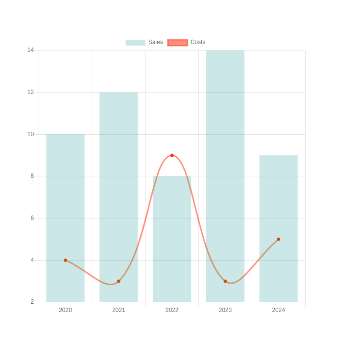

I really love charts and wanted to embrace a library for client side visualisation. I've hacked around with a method to use Chart.js with Gridsome and created a simple demo site detailing my progress thus far. It's rough but hopefully it illustrates a way to get started.

Essentially, I created a new Gridsome project, installed a couple of modules and built some examples including using charts in pages, templates and hack in progress to define charts from within markdown files. Netlify made it easy to spin up a [demo](https://hungry-babbage-b374c1.netlify.app/) from my [repo](https://github.com/scrambldchannel/gridsome-chartjs-examples).

Note, embedding a chart, or indeed any vue component, in a blog post is a bit fiddly. There doesn't currently seem to be a way to embed copmonents in markdown files that are handled by `source-filesystem`. It is possible, although a bit limited in my experimentation, to embed components using the `vue-remark` plugin but this plugin doesn't offer the same flexibility. There are examples on my [demo site](https://hungry-babbage-b374c1.netlify.app/) but here is a screenshot showing a basic chart:

