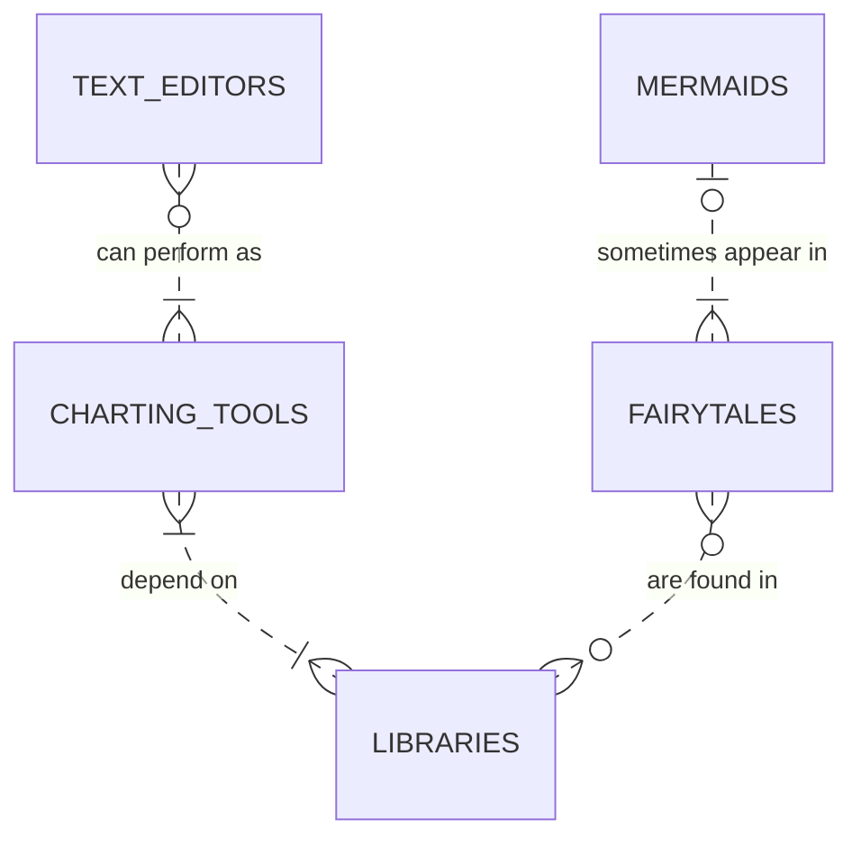
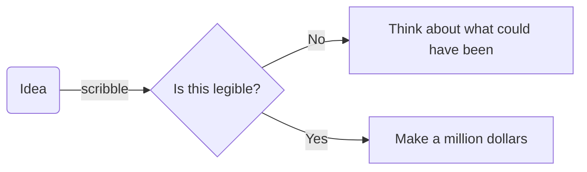

It's the 14th of February so rather buy any useless stuff I don't need for a fake holiday, I thought I'd play with a charting library. I have only recently discovered [Mermaid](https://mermaid-js.github.io/mermaid/#/), an awesome way to create charts using what they describe as "Markdown-inspired syntax".

For example, this somewhat questionable ER diagram...



...can be rendered with a couple of lines of code.

```
erDiagram
          MERMAIDS |o..|{ FAIRYTALES : "sometimes appear in"
          TEXT_EDITORS }o..|{ CHARTING_TOOLS : "can perform as"
          CHARTING_TOOLS }|..|{ LIBRARIES : "depend on"
          FAIRYTALES }o..o{ LIBRARIES : "are found in"
```

It seems trite, but scribbling out ideas on paper is something I still find really useful but it's something I mostly do for my own benefit. When it comes to sharing these artworks with collaborators, I'm often the only one that can reliably decipher them. So a concise and lightweight way to share is something I'm in the market for.



I've never really gotten on with tools like Visio. I fell at the first learning curve hurdle and it didn't help that I was usually asked to do something with it as afterthought at the tail end of a project. There are scores of lighter options, desktop and browser based, but nothing compares to being able to create these diagrams right from your editor of choice.
