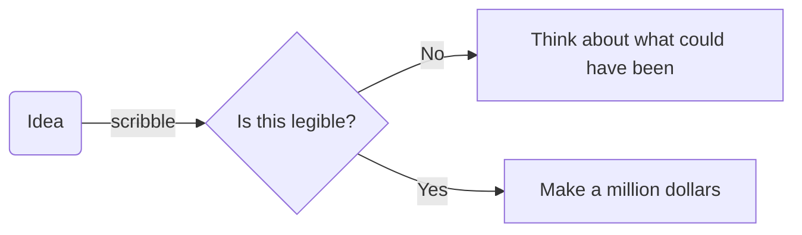
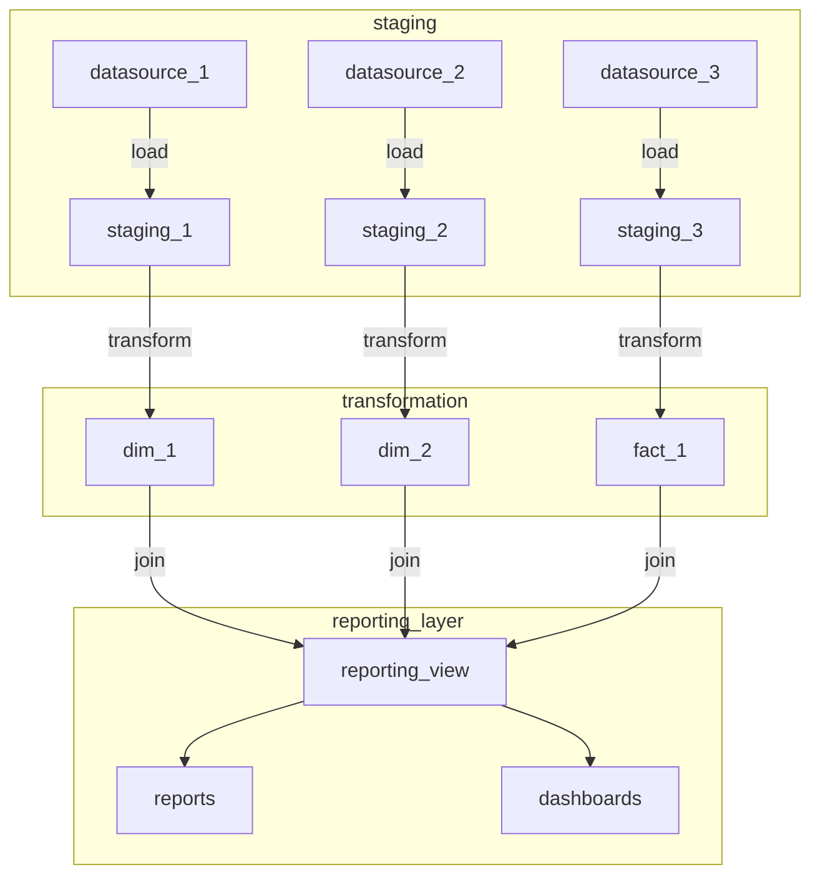

```
erDiagram
          MERMAIDS |o..|{ FAIRYTALES : "sometimes appear in"
          TEXT_EDITORS }o..|{ CHARTING_TOOLS : "can perform as"
          CHARTING_TOOLS }|..|{ LIBRARIES : "depend on"
          FAIRYTALES }o..o{ LIBRARIES : "are found in"
```




